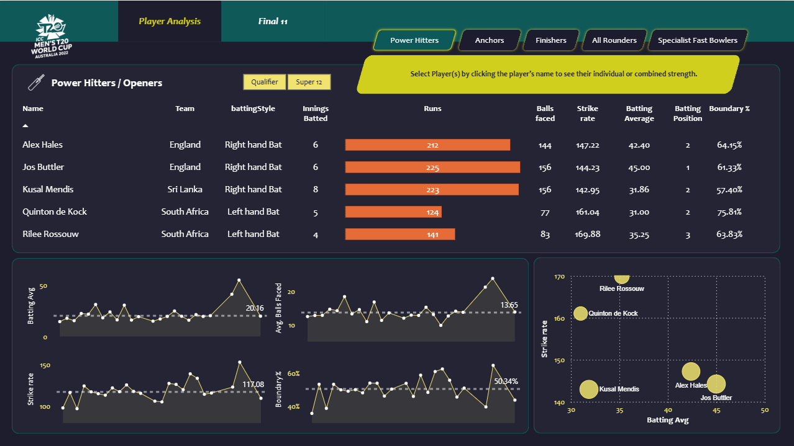

# Cricket T20 World Cup 2022 - Best 11 Player Analysis

This repository contains a data analysis project focused on identifying and selecting the **"Best 11"** cricket players from the **ICC Men's T20 World Cup 2022** based on in-depth performance statistics.

The project utilizes Power BI to clean, model, and visualize player data, offering a systematic and data-driven approach to team selection across various specialized roles.

---

### Files and Folders Explained:

* **`T20_Player_Data/`**: This directory holds all the raw data files that feed into the Power BI data model.
* **`T20_World_Cup_2022_Best11.pbix`**: The main Power BI Desktop file. It includes the entire data model, calculated measures (DAX), and all the interactive dashboard pages.
* **`t20_2022_power_hitters_analysis.png`**: A visual snapshot of the "Power Hitters / Openers" section of the dashboard, providing a preview of the analysis.
* **`README.md`**: This overview document.

---

## How to View the Project

1.  **Download:** Clone the repository or download all its contents.
2.  **Software:** Ensure you have **Power BI Desktop** installed on your system.
3.  **Open:** Open the file `T20_World_Cup_2022_Best11.pbix` directly using Power BI Desktop.

***

## Key Analysis Preview: Power Hitters

The analysis focuses on balancing high strike rates (aggression) with high averages (consistency). The included screenshot shows the performance metrics for top openers and power hitters.

| Player | Team | Strike Rate | Batting Average | Boundary % |
| :--- | :--- | :--- | :--- | :--- |
| **Jos Buttler** | England | 144.23 | **45.00** | 61.33% |
| **Rilee Rossouw** | South Africa | **169.88** | 35.25 | 63.83% |
| **Quinton de Kock**| South Africa | 161.04 | 31.00 | **75.81%** |

### Insights:

* **Consistency vs. Aggression:** The analysis highlights top performers like **Jos Buttler** for consistency (highest average) and **Rilee Rossouw** for pure aggression (highest strike rate).
* **Boundary Reliance:** **Quinton de Kock** shows the highest proportion of his runs scored in boundaries, underscoring his high-risk, high-reward approach.

Explore the full dashboard to see the analysis for other player types, such as Anchors, Finishers, All-Rounders, and Specialist Bowlers!

---

## Contribution

Feel free to download the data and Power BI file to enhance the analysis, suggest new performance metrics, or improve the visualizations!
